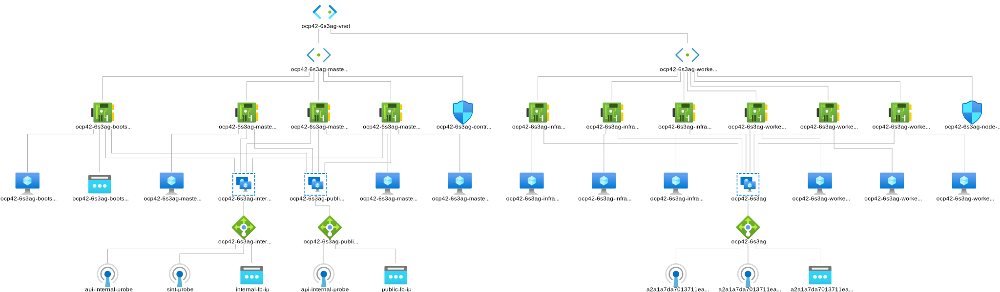

# OpenShift 4 UPI on Azure Cloud

This [terraform](terraform.io) implementation will deploy OpenShift 4.x into an pair of Azure VNETs, with two subnets for controlplane and worker nodes.  Network Security Groups allow specific traffic from one VNET from another.  Traffic to the master nodes is handled via a pair of loadbalancers, one for internal traffic and another for external API traffic.  Application loadbalancing is handled by a third loadbalancer that talks to the router pods on the infra nodes.  Worker, Infra and Master nodes are deployed across 3 Availability Zones

 


We use different Terraform modules to achieve these results:

1. `modules/1_infrastructure` - Creates the network infrastrucure to deploy OpenShift
   * Creates a resource group	
   * git commCreates a VNET and subnets
   * Creates network security groups to handle traffic
   * Creates LoadBalancers and assigns node pools
   * Creates storage for ignition and azure-file storageclass
   * Assigns necesary IAM permissions to the ApplicationID
2. `modules/2_dns` - Updates records on a pre-existing DNS zone hosted by azure on another resource group
   * api.<cluster_id>.example.com
   * *.apps.<cluster_id>.example.com
3. `modules/3_ignition` - Downloads OpenShift installer and utilities, and generates the modifications required for OpenShift on Azure, and ignition config files to boot the CoreOS images, and stores them in a blobstore.
4. `modules/4_bootstrap`- Generates a bootstrap node for initial OpenShift deployment.  This node can be deleted at a later time with `terraform destroy -target=module.bootstrap`
5. `modules/5_nodes` - Generates CoreOS nodes.  Used for master nodes
6. `modules/6_deploy` - Deploys OpenShift into infrastructure and patches cluster to use azure-file for image-registry.

# Prerequisites

1.  [Configure DNS](https://github.com/openshift/installer/blob/d0f7654bc4a0cf73392371962aef68cd9552b5dd/docs/user/azure/dnszone.md) 

2. [Create a Service Principal](https://github.com/openshift/installer/blob/d0f7654bc4a0cf73392371962aef68cd9552b5dd/docs/user/azure/credentials.md) with proper IAM roles 


# Minimal TFVARS file

```terraform
azure_region           = "eastus2"
openshift_cluster_name = "ocp42"

# From Prereq. Step #1
base_domain                   = "azure.ncolon.xyz"
azure_dns_resource_group_name = "ncolon-keyvault-rg"

# From Prereq. Step #2
azure_subscription_id  = "XXXXXXXX-XXXX-XXXX-XXXX-XXXXXXXXXXXX"
azure_tenant_id        = "YYYYYYYY-YYYY-YYYY-YYYY-YYYYYYYYYYYY"
azure_client_id        = "ZZZZZZZZ-ZZZZ-ZZZZ-ZZZZ-ZZZZZZZZZZZZ"
azure_client_secret    = "AAAAAAAA-AAAA-AAAA-AAAA-AAAAAAAAAAAA"
```


# Customizable Variables

| Variable                              | Description                                                  | Default         | Type   |
| ------------------------------------- | ------------------------------------------------------------ | --------------- | ------ |
| azure_subscription_id                 | Subscription ID for Azure Account                            | -               | string |
| azure_tenant_id                       | Tenant ID for Azure Subscription                             | -               | string |
| azure_client_id                       | Application Client ID (from Prereq Step #2)                  | -               | string |
| azure_client_secret                   | Application Client Secret (from Prereq Step #2)              | -               | string |
| azure_region                          | Azure Region to deploy to                                    | -               | string |
| openshift_cluster_name                | Cluster Identifier                                           | -               | string |
| openshift_master_count                | Number of master nodes to deploy                             | 3               | string |
| openshift_worker_count                | Number of worker nodes to deploy                             | 3               | string |
| machine_cidr                          | CIRD for OpenShift VNET                                      | 10.0.0.0/16     | string |
| base_domain                           | DNS name for your deployment                                 | -               | string |
| azure_dns_resource_group_name         | Resource group where DNS is hosted.  Must be on zame region. | -               | string |
| azure_bootstrap_vm_type               | Size of bootstrap VM                                         | Standard_D4s_v3 | string |
| azure_master_vm_type                  | Size of master node VMs                                      | Standard_D4s_v3 | string |
| azure_infra_vm_type                  | Size of infra node VMs                                      | Standard_D4s_v3 | string |
| azure_worker_vm_type                  | Sizs of worker node VMs                                      | Standard_D4s_v3 | string |
| openshift_cluster_network_cidr        | CIDR for Kubernetes pods                                     | 10.128.0.0/14   | string |
| openshift_cluster_network_host_prefix | Detemines the number of pods a node can host.  23 gives you 510 pods per node. | 23              | string |
| openshift_service_network_cidr        | CIDR for Kubernetes services                                 | 172.30.0.0/16   | string |
| openshift_pull_secret                 | Filename that holds your OpenShift [pull-secret](https://cloud.redhat.com/openshift/install/azure/installer-provisioned) | -               | string |
| azure_master_root_volume_size         | Size of master node root volume                              | 1024            | string |
| azure_worker_root_volume_size         | Size of worker node root volume                              | 128             | string |
| azure_infra_root_volume_size         | Size of infra node root volume                              | 128             | string |
| azure_rhcos_image_url                  | URL of the CoreOS image. Can be found [here](https://github.com/openshift/installer/blob/master/data/data/rhcos.json)                      | https://rhcos.blob.core.windows.net/imagebucket/rhcos-42.80.20190823.0.vhd | string |


# Deploy with Terraform

1. Clone github repository
	```bash
	git clone git@github.ibm.com:ncolon/ocp4-azure-upi.git
	```

2. Create your `terraform.tfvars` file

3. Deploy with terraform
	```bash
  $ terraform init
  $ terraform plan
  $ terraform apply
  ```
4.  Destroy bootstrap node
	```bash
	$ TF_VAR_bootstrap_complete=true terraform apply
	```
5.  To access your cluster
	```bash
   $ export KUBECONFIG=$PWD/installer-files/auth/kubeconfig
   $ oc get nodes
   NAME                   STATUS   ROLES    AGE    VERSION
   ocp42-kktg0-master-0   Ready    master   104m   v1.14.6+c07e432da
   ocp42-kktg0-master-1   Ready    master   104m   v1.14.6+c07e432da
   ocp42-kktg0-master-2   Ready    master   104m   v1.14.6+c07e432da
   ocp42-kktg0-worker-0   Ready    worker   104m   v1.14.6+c07e432da
   ocp42-kktg0-worker-1   Ready    worker   104m   v1.14.6+c07e432da
   ocp42-kktg0-worker-2   Ready    worker   104m   v1.14.6+c07e432da
  ```


# Infra and Worker Node Deployment

Deployment of Openshift Worker and Infra nodes is handled by the machine-operator-api cluster operator.

```bash
$ oc get machineset -n openshift-machine-api
NAME                          DESIRED   CURRENT   READY   AVAILABLE   AGE
ocp42-f5k8m-infra-eastus21    1         1         1       1           12h
ocp42-f5k8m-infra-eastus22    1         1         1       1           12h
ocp42-f5k8m-infra-eastus23    1         1         1       1           12h
ocp42-f5k8m-worker-eastus21   1         1         1       1           12h
ocp42-f5k8m-worker-eastus22   1         1         1       1           12h
ocp42-f5k8m-worker-eastus23   1         1         1       1           12h

$ oc get machines -n openshift-machine-api
NAME                                STATE     TYPE              REGION    ZONE   AGE
ocp42-f5k8m-infra-eastus21-7f9sv    Running   Standard_D4s_v3   eastus2   1      12h
ocp42-f5k8m-infra-eastus22-tsh7s    Running   Standard_D4s_v3   eastus2   2      12h
ocp42-f5k8m-infra-eastus23-vw5mc    Running   Standard_D4s_v3   eastus2   3      12h
ocp42-f5k8m-worker-eastus21-8sgs5   Running   Standard_D8s_v3   eastus2   1      12h
ocp42-f5k8m-worker-eastus22-zqmc5   Running   Standard_D8s_v3   eastus2   2      12h
ocp42-f5k8m-worker-eastus23-q9g5v   Running   Standard_D8s_v3   eastus2   3      12h
```

The infra nodes host the router/ingress pods, all the monitoring infrastrucutre, and the image registry.